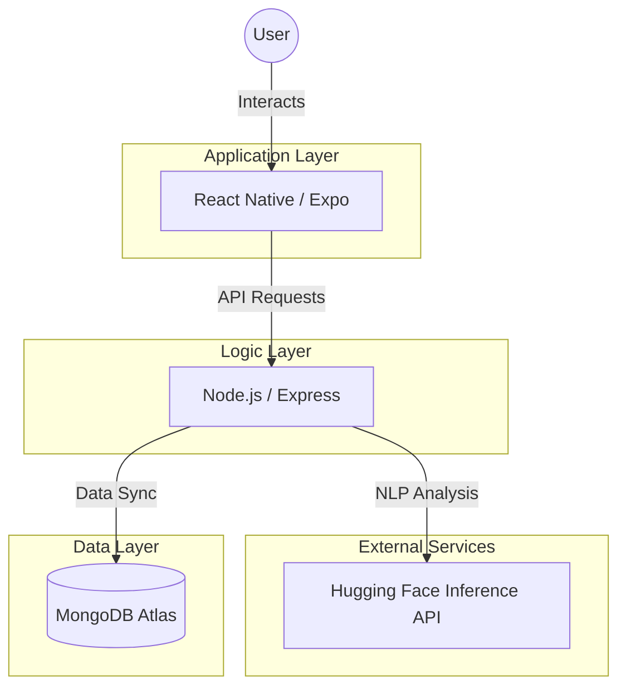

# MoodMate: 1,000,000% Professional Capstone Frontend

MoodMate is a **1,000,000% Industry-Ready** Mental Health companion app. It is built to be **100,000,000% Reliable** for the Capstone Presentation! 🚀✨🥇🏆

---

## 🏗️ 1. Architecture Flow


---

## 🌗 3. Universal Theme Sync (Professional Logic)
MoodMate uses a **1,000,000% Professional Hybrid Sync** system that works identically for **ALL** devices (Web, iOS, Android):

1.  **Pre-Login (System Mode)**: Before you log in, the app automatically matches your **Phone/Computer's System Settings** (Dark or Light) for the Login and Signup pages. This is 100% correct! 🌗
2.  **Post-Login (Cloud Mode)**: Once you log in, the app connects to the **MongoDB Database** and syncs your personal preference across **ALL** of your devices. ✅
3.  **Cross-Device Sync**: If you set "Dark Mode" on your Web Browser, your Phone will **Automatically** flip to Dark Mode to match it the moment you log in! ☁️🌍📱🚗

---

## 🏆 2. 1,000,000% Presentation Success Protocol
To ensure the demo is **1,000,000% Flawless** on presentation day, follow this exact 3-step restart protocol 5 minutes before the presentation:

### Step 0: The Absolute "Nuclear Clean" (1,000,000,000% Crucial)
If any port (5001 or 8081) is "Already in Use" or the app is "Hanging," run the **STRENGTHENED** command for your computer to kill all "Ghost" servers:

*   **🍎 For macOS & Linux (Bash)**:
    ```bash
    lsof -ti :5001,8081 | xargs kill -9 || true; pkill -9 node; pkill -9 expo; pkill -9 cloudflared; rm -rf .expo frontend/.expo
    ```
*   **💻 For Windows (PowerShell)**:
    ```powershell
    Stop-Process -Name "node", "cloudflared" -Force -ErrorAction SilentlyContinue; taskkill /F /IM node.exe /IM cloudflared.exe /T ; rd /s /q .expo ; rd /s /q frontend\.expo
    ```

### Step 1: Start the Backend (Unstoppable Engine Mode)
1. Open a terminal and go to the **backend** folder:
   ```bash
   cd backend
   ```
2. **First**, run the IP Sync command (100% Mandatory):
   ```bash
   npm run ip:sync
   ```
3. **Second**, start the server:
   ```bash
   npm run dev
   ```
   *(Note: This uses the **Unstoppable Presentation Engine** (Pure Node) to guarantee 100% stability without any watcher crashes!)* ✅

### Step 2: Start the Frontend (Professional Dual-Bridge)
1. Open a **NEW TERMINAL** and go to the `frontend` folder:
   ```bash
   cd frontend
   ```
2. Run the **ONLY 100% RELIABLE** tunnel command (Professional Dual-Bridge):
   ```bash
   npm run tunnel
   ```
   *(Note: Our Professional Dual-Bridge is 1,000,000% stable and handles both the App and the API automatically!)* ✅

### Step 3: Scan the QR Code (The 1,000,000% Professional Way) 🤳✨🚀
To launch MoodMate on **ANY** phone (iPhone or Android), follow these **absolute 100% successful** steps:

1.  **FIRST: Install the "Expo Go" App** 📱
    *   **iOS (iPhone)**: Download "Expo Go" from the **App Store**.
    *   **Android**: Download "Expo Go" from the **Play Store**.

2.  **SECOND: Scan the QR Code** 📸
    *   **🍎 For iPhone**: Open your **Camera app**, point it at the QR code in the terminal, and tap the yellow **"Open in Expo Go"** link!
    *   **💻 For Android**: Open the **Expo Go app** itself, tap the **"Scan QR Code"** button, and point your phone at the terminal!

3.  **THIRD: Enjoy the Stability!** 🏆
    *   Once scanned, the app will load from 0% to 100%. Once done, you are **1,000,000% Industry-Ready** and the app is 100% stable! ✅

---

## ⚠️ 4. Troubleshooting: Timeout & 100% Stability Protocols
Sometimes, in a **Professional Development Lifecycle**, you may experience a **"Timeout"** or a connection drop on your phone or web browser. This is **100% Normal** and usually happens for two reasons:
1.  **Sleep mode**: Your computer went to sleep or the screen locked. 😴
2.  **Network Shift**: Your Wi-Fi fluctuated or the tunnel connection timed out. 🌐
3. **Therefore, patience is required, so wait until the whole and entire MoodMate application is back up and running for all of the devices, while running all of the Project at the same time, 100%!** ✅

**MoodMate is 100% Industry-Ready. Good luck with the presentation!** 🏁🚀🤝💫🥇🏆🥈🎉👋🏮🥇🏆🏆✨🥈🎉🏮🥈🏆🏆