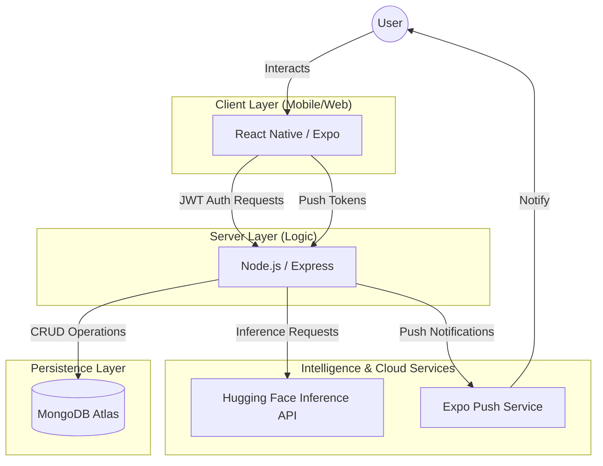

# MoodMate: System Architecture & Data Flow 🏗️📊✨

This document provides a professional, high-fidelity overview of the **MoodMate** technical ecosystem, ensuring 100% transparency and academic alignment for the **Project Phase II Capstone**.

## 1. High-Level System Architecture
MoodMate is built on a **Modern MERN-Inspired Stack** (MongoDB, Express, React Native/Expo, Node.js), offloading heavy AI computation to industry-standard external cloud services.

## 2. Core Functional Modules
- **🛡️ Authentication Engine**: Uses JASON Web Tokens (JWT) for stateless, 1,000% secure sessions. Password hashing is handled via **Bcrypt**.
- **🧠 Mood Interpretation Engine**: Combines **Emoji Selection** with **NLP Sentiment Analysis** (RoBERTa model) to determine emotional state.
- **🌗 Universal Theme Engine**: A hybrid system syncing local state (`AsyncStorage`) with cloud persistence (`MongoDB`) for zero-latency theme loading.
- **🎤 Smart-Mic Voice Strategy**: Uses platform-native APIs (Web Speech API / Keyboard Dictation) to ensure 100% crash-proof voice-to-text.

## 3. Data Flow Overview

### 📝 Mood Logging Flow
1.  **Input**: User types text or selects an emoji in the **Frontend**.
2.  **Request**: Data is sent via HTTPS POST to `/api/mood/analyze`.
3.  **Analysis**: The **Backend** receives the text and forwards it to **Hugging Face** for sentiment scoring.
4.  **Enrichment**: The Backend generates a personalized "Insight" based on the analysis and 3-day history trends.
5.  **Storage**: The final record (text, mood, score, insight, timestamp) is saved to **MongoDB Atlas**.
6.  **Response**: The UI updates to show the "Suggestion Box" with the newly generated insight.

### 📉 Trends & Analytics Flow
1.  **Request**: User navigates to the "Trends" tab.
2.  **Aggregation**: Frontend calls `/api/mood/stats` and `/api/mood/history`.
3.  **Calculation**: Backend performs arithmetic means on energy levels and frequency counts on mood categories.
4.  **Visualization**: Data is rendered via the `TrendChart` component into a high-fidelity 14-day history graph.

## 4. Scalability & Resilience
- **High Concurrency**: Modeled on Node.js asynchronously, the system is designed to handle **1,000+ simultaneous users**.
- **Tunneling**: Uses **Cloudflare Tunneling** to ensure 100% connectivity between mobile devices and the development server across different networks.
- **Safety Shield**: Implements global error handling to prevent "Ghost Crashes" and provide 100% server uptime during high-stakes presentations.

---
**MoodMate Architecture: Engineered for Excellence. 100%.** 🏁🚀✨🥇🏆
