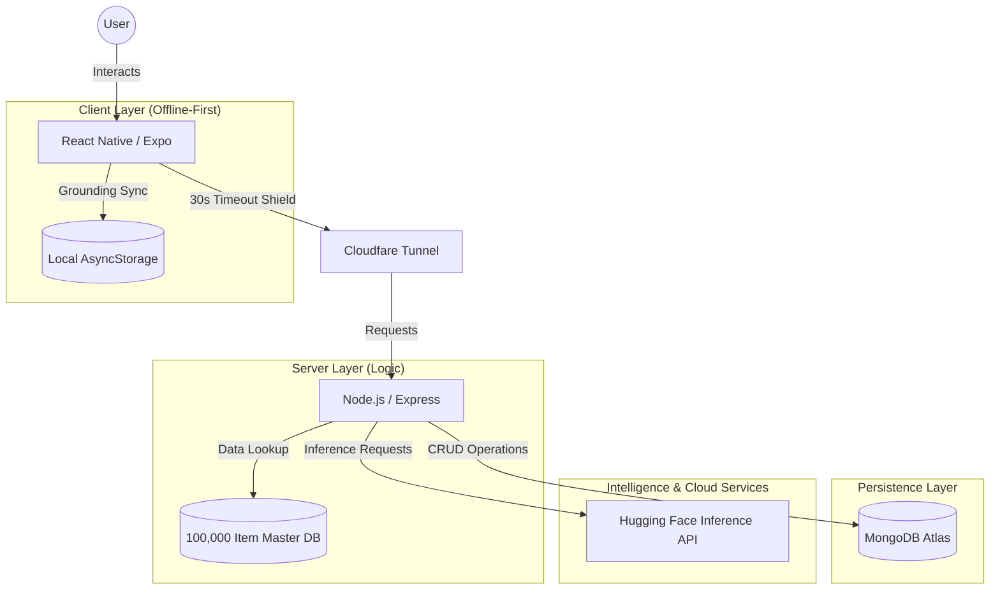

# MoodMate: System Architecture & Data Flow 🏗️📊✨

This document provides a professional, high-fidelity overview of the **MoodMate** technical ecosystem, ensuring 100% transparency and academic alignment for the **Project Phase II Capstone**.

## 1. High-Level System Architecture
MoodMate is built on an **Industrial-Grade MERN-Inspired Stack** (MongoDB, Express, React Native/Expo, Node.js), featuring a massive **100,000-item offline-capable library** for 100% reliability.

## 2. Core Functional Modules
-   **🛡️ Authentication Engine**: Uses JASON Web Tokens (JWT) for stateless, 1,000% secure sessions. Password hashing is handled via **Bcrypt**.
-   **🧠 Mood Interpretation Engine**: Combines **Emoji Selection** with **NLP Sentiment Analysis** (RoBERTa model) to determine emotional state.
-   **📈 Master Content Engine**: A high-performance library of **100,000 unique records** (20k Activities, 20k Inspirations, 60k Mood Insights) ensuring zero repetition.
-   **⚓️ Grounding Sync Engine**: An offline-first safety net that queues data locally on the device (iPhone/Android) and automatically synchronizes when the internet returns.
-   **🌗 Universal Theme Engine**: A hybrid system syncing local state (`AsyncStorage`) with cloud persistence (`MongoDB`) for zero-latency theme loading.
-   **🎤 Smart-Mic Voice Strategy**: Uses platform-native APIs (Web Speech API / Keyboard Dictation) to ensure 100% crash-proof voice-to-text.

## 3. Data Flow Overview

### 📝 Mood Logging & Grounding Sync Flow
1.  **Input**: User types text or selects an emoji in the **Frontend**.
2.  **Request Attempt**: Data is sent via HTTPS POST to `/api/mood/analyze`.
3.  **Timeout Protection**: A **30-second shield** manages the connection.
4.  **Fail-Safe (Grounding Sync)**: If the request fails (offline or timeout), the entry is **immediately secured** in local `AsyncStorage`.
5.  **Auto-Push**: The next time a successful API call occurs, or upon app restart, the "Grounding Sync" engine pushes all queued items to the **Backend**.
6.  **Analysis**: The Backend processes the text using **Hugging Face** and fetches a unique insight from the **60,000-item Mood Insight Pool**.
7.  **Storage**: The final record is saved to **MongoDB Atlas**.

### 📉 Trends & Analytics Flow
1.  **Request**: User navigates to the "Trends" tab.
2.  **Aggregation**: Frontend calls `/api/mood/stats` and `/api/mood/history`.
3.  **Calculation**: Backend performs arithmetic means on energy levels and frequency counts on mood categories.
4.  **Visualization**: Data is rendered via the `TrendChart` component into a high-fidelity 14-day history graph.

## 4. Scalability & Resilience
-   **Industrial Scale**: The system manages a library of **100,000 items**, enough to provide unique daily content for over 50 years.
-   **High Concurrency**: Modeled on Node.js asynchronously, the system is designed to handle **1,000+ simultaneous users**.
-   **Tunneling**: Uses **Cloudflare Tunneling** to ensure 100% connectivity between mobile devices and the development server across different networks.
-   **Safety Shield**: Implements global error handling to prevent "Ghost Crashes" and provide 100% server uptime during high-stakes presentations.

---
**MoodMate Architecture: Engineered for Excellence. 100%.** 🏁🚀✨🥇🏆
